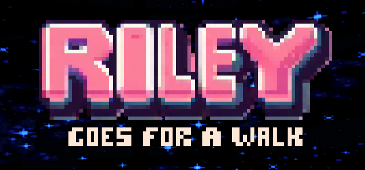

  

# Riley Goes For A Walk

Hexagonal-grid, turn-based tactics game built with Unity and C#. You play as Riley, an experimental lab creature escaping through procedurally generated floors while outsmarting enemies with positional combat.

Created by **Sergio Herreros Pérez** and **José Ridruejo Tuñón**.

> 🚀 _Ready to help Riley escape?_
> [▶ Play Online](https://sergihrs.github.io/Riley-Goes-For-A-Walk/) right in your browser!

## Core Gameplay

- The map is a **hexagonal grid** and each floor is procedurally generated.
- The run contains **5 floors**, with enemy pressure increasing per level.
- Riley can perform two combat actions per move:
  - **Melee side hit**: can eliminate enemies adjacent to the movement direction.
  - **Frontal hit**: moving directly toward an enemy can trigger a forward kill.
- Two objective structures drive progression:
  - **Incubator**: drain mutagenic fluid to evolve and gain one heart.
  - **Elevator**: move to the next floor.

## Enemy Roster

<table>
  <tr>
    <th align="center">Hazmat</th>
    <th align="center">Swat</th>
    <th align="center">FireWarden</th>
  </tr>
  <tr>
    <td align="center">
      
    </td>
    <td align="center">
      
    </td>
    <td align="center">
      
    </td>
  </tr>
  <tr>
    <td align="center">Close-range melee threat. Attacks adjacent cells.</td>
    <td align="center">Long-range line attacker (up to 5 cells). Cannot attack adjacent cells.</td>
    <td align="center">Short-to-mid range line threat (up to 2 cells) with flame attacks.</td>
  </tr>
</table>

## Controls

- **Left click Riley or an enemy**: preview attackable/controlled cells.
- **Left click an empty cell or structure**: preview shortest path.
- **Left click a yellow highlighted adjacent cell**: move immediately.
- **Left click a cyan path cell**: advance one step along that path.

## Gameplay

  

## Tech Stack And Engineering Highlights

- **Engine**: Unity
- **Language**: C#

### OOP And Design Patterns

- **Inheritance hierarchy**:
  - `Entity` base class with `Player` and `Enemy` specializations.
  - `Enemy` subclassed into `Swat`, `Hazmat`, `FireWarden` with distinct behavior.
  - `Structure` and `Tile` abstraction layers for map composition.
- **Patterns used**:
  - **Singleton**: central game orchestration in `GameManager`.
  - **State machine**: turn flow (`PlayerTurn`, animation phases, `EnemyTurn`, `GameOver`, `Victory`).
  - **Strategy-style enemy AI**: each enemy type overrides move and attack logic.
  - **Observer/event-driven UI**: `GameInfo` events update HUD through UI listeners.

### Coordinate Logic, Pathfinding, And AI

- **Hex coordinate system** with explicit 6-neighbor relationships per cell.
- **BFS pathfinding** for movement and target approach (including adjacent-target resolution for structures/AI).
- **Enemy intelligence** combines path planning, range constraints, and collision-aware targeting.
- **Procedural generation pipeline** creates protected routes, hazards, structure placement, and level-scaled enemy composition.

## Future Work

- **Additional content**: new enemy types, more floors, and unique structures.
- **Enhanced visuals**: improved art assets, animations, and effects.
- **Expanded mechanics**: new combat actions, environmental hazards, and player abilities.
- **Polish and optimization**: performance improvements, UI refinements, and bug fixes.
